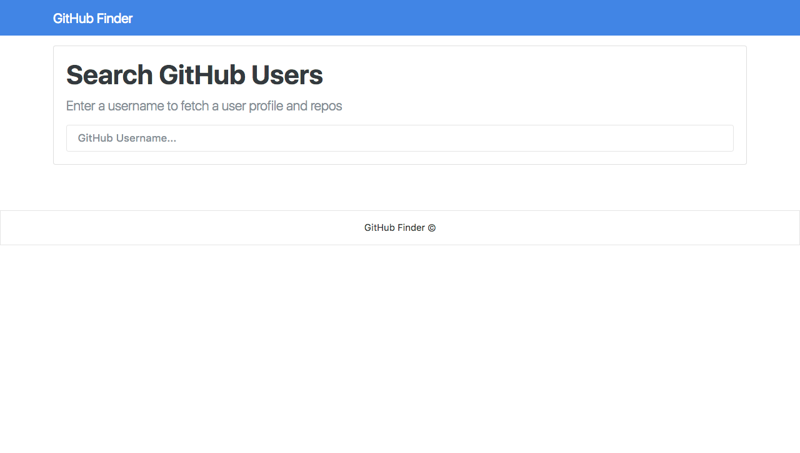

> Application that lets the user search for any Github profile using it's API.

## Getting Started

Clone or download ZIP and open inex.html.

## License

Coded by [Leonardo Da Costa](https://github.com/costaleonardo). Licensed under the [MIT License](https://cjpatoilo.mit-license.org).
